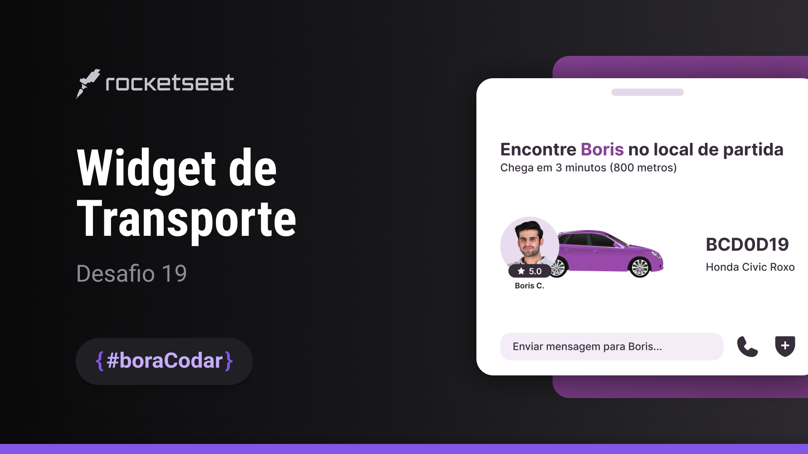

  

## 💻 Desafio 
A proposta foi a criação de um widget de transporte estilo Uber.

## 🚀 Tecnologias
Esse projeto foi desenvolvido com as seguintes tecnologias: 
- HTML
- CSS
- Github 

## 🏷 Layout
Você pode visualizar o layout do desafio através [desse link](https://www.figma.com/file/bwrfqaFqTo5GQDUszZtfwe/Widget-de-Transporte?type=design&node-id=514-19&t=XP5STCdtYHtMR4tU-0). 
É necessário ter uma conta no [Figma](https://www.figma.com).